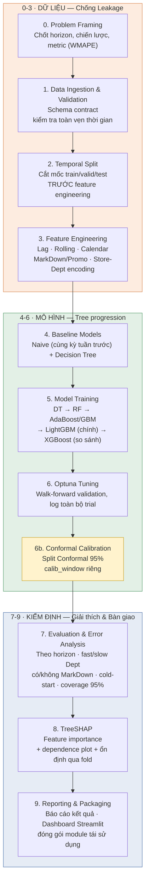
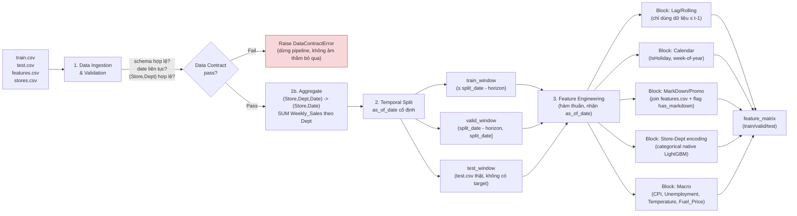
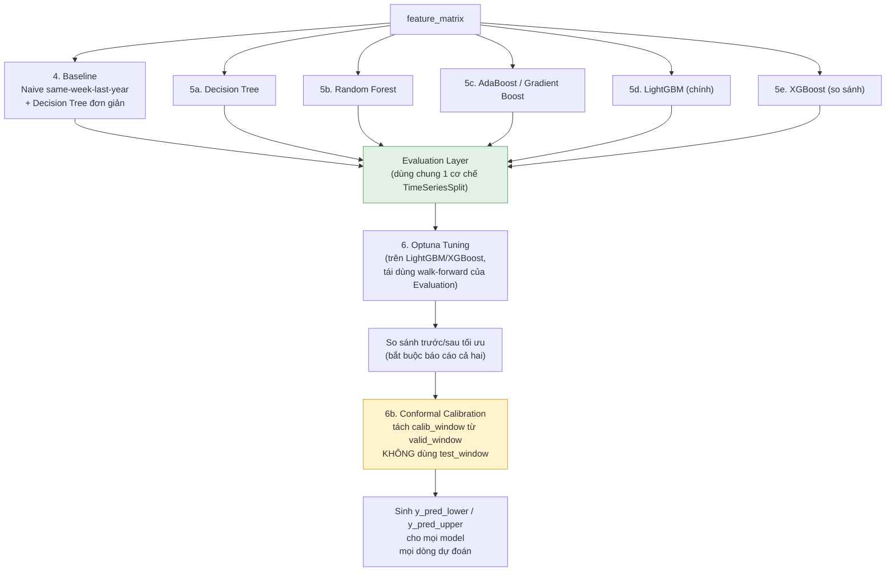
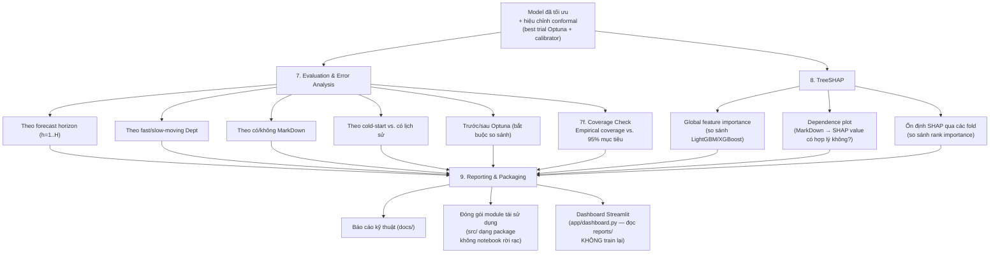

# Sơ đồ giải thuật — Kiến trúc Pipeline 10 Giai đoạn

**AIO Conquer 2026 — Module 03 · Project 3.2**

> Mỗi giai đoạn = 1 module độc lập, input/output rõ ràng, không rò rỉ thông tin giữa các giai đoạn.
> Tham chiếu quyết định chưa chốt (horizon/strategy) ở `01_ideation.md` mục 4 — sơ đồ dưới đây **không phụ thuộc** vào lựa chọn A/B/C, chỉ giai đoạn 3 và 5 có nhánh rẽ nội bộ.

---

## 1. Sơ đồ tổng thể (flowchart)

---

## 2. Chi tiết Giai đoạn 0–3 — Nền tảng chống Data Leakage

**Quy tắc bất biến (invariant) của Giai đoạn 0–3:**
- **(Cập nhật 2026-08-19)** Giai đoạn 1b (Aggregate) đổi đơn vị dự báo từ (Store, Dept, Date) sang (Store, Date) NGAY SAU Data Contract, TRƯỚC Temporal Split — xem `docs/00_decisions.md` "Đổi đơn vị dự báo". Đây là thay đổi đơn vị quan sát, không phải feature, nên phải xảy ra sớm nhất.
- Cắt mốc thời gian **trước**, tính feature **sau** — không đảo thứ tự.
- Mỗi block feature là **hàm thuần** `f(df, as_of_date) -> df_features`, không có side-effect, không nhìn quá khứ toàn cục nếu chưa qua as_of_date.
- Data Contract (giai đoạn 1) là nơi **duy nhất** kiểm tra schema — các giai đoạn sau không lặp lại kiểm tra rải rác.

---

## 3. Chi tiết Giai đoạn 4–6 — Modeling & Tuning

**Quy tắc bất biến:**
- Mọi model (kể cả baseline) đi qua **cùng một Evaluation Layer** — không viết logic đánh giá riêng cho từng model.
- Optuna chỉ được thấy `train_window` + `valid_window`, không bao giờ chạm `test_window`.
- Optuna tái dùng đúng cơ chế walk-forward split của Evaluation Layer (giai đoạn 6 gọi lại module của giai đoạn 4-6, không tự viết CV riêng).
- **Conformal Calibration (6b) chạy SAU khi Optuna đã chốt best trial**, dùng phần `calib_window` tách riêng từ `valid_window` (không phải phần đã dùng cho Optuna) — chi tiết đầy đủ và lý do thiết kế ở `08_uncertainty_conformal.md`.

---

## 4. Chi tiết Giai đoạn 7–9 — Kiểm định, Giải thích, Bàn giao

---

## 5. Bảng tóm tắt Input → Output theo từng giai đoạn

| Giai đoạn | Input | Output | Rủi ro chính cần test |
|---|---|---|---|
| 0. Problem Framing | Tài liệu đề bài, checklist | `docs/00_decisions.md` | Quyết định không được ghi lại → tranh cãi giữa chừng |
| 1. Data Ingestion | 4 CSV thô | `RawDataBundle` đã validate | Schema sai, ngày trùng/thiếu, (Store,Dept) không hợp lệ |
| 1b. Aggregate *(2026-08-19)* | `RawDataBundle` đã validate | Train/test đã gộp về (Store, Date), Dept không còn tồn tại | Aggregate SUM sai (double-count khi join lại), IsHoliday không nhất quán bị `.first()` chọn sai |
| 2. Temporal Split | `RawDataBundle` + `as_of_date`/`split_date` | `train_window`, `valid_window`, `test_window` | Rò rỉ dữ liệu tương lai vào train |
| 3. Feature Engineering | 3 window ở trên | `feature_matrix` (mỗi block riêng) | Lag/rolling dùng dữ liệu > t−1; join `features.csv` nhân bản dòng |
| 4. Baseline | `feature_matrix` (train) | `baseline_predictions` | Baseline bị bỏ qua, không có mốc so sánh |
| 5. Model Training | `feature_matrix` | Model đã fit (DT/RF/AdaBoost-GBM/LightGBM/XGBoost) | Train/predict không dùng cùng bộ feature |
| 6. Optuna Tuning | `train_window`, `valid_window`, search space | `best_params`, `trial_history` | Tuning nhìn thấy test_window (leakage gián tiếp) |
| 6b. Conformal Calibration | Model đã tối ưu + `calib_window` (tách từ `valid_window`) | Calibrator (giá trị `q`), sinh `y_pred_lower/upper` | Dùng nhầm `train_window` hoặc `test_window` để hiệu chỉnh; dùng `np.quantile` trần thay vì hiệu chỉnh hữu hạn mẫu |
| 7. Evaluation | Model + `test_window`/`valid_window` + calibrator | Bảng metric theo nhiều lát cắt + coverage report | Chỉ báo cáo 1 con số tổng, che giấu yếu điểm theo nhóm; không kiểm tra coverage thực tế |
| 8. TreeSHAP | Model đã tối ưu + `feature_matrix` | SHAP values, dependence plot (theo từng model) | Diễn giải nhân quả sai (confounding giá & khuyến mãi) |
| 9. Reporting | Toàn bộ kết quả trên | Báo cáo + package `src/` + Dashboard Streamlit | Code chỉ tồn tại trong notebook, không tái dùng được; dashboard tự train lại thay vì chỉ đọc kết quả |

Chi tiết schema từng bảng dữ liệu và luồng input/output đầy đủ: xem `03_data_io_diagram.md`. Chi tiết Conformal Calibration: `08_uncertainty_conformal.md`. Chi tiết Dashboard: `07_dashboard_spec.md`. Chi tiết môi trường: `06_environment_setup.md`.
