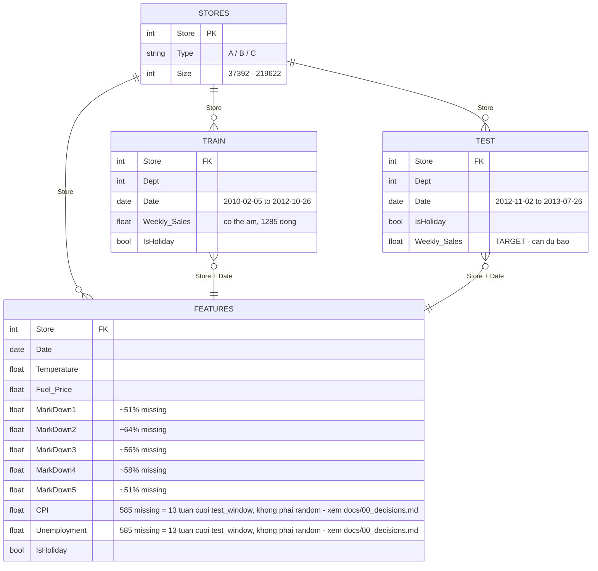

# Sơ đồ Input/Output của Data

**AIO Conquer 2026 — Module 03 · Project 3.2**

> Toàn bộ schema dưới đây lấy từ khảo sát trực tiếp file thật trong `data/raw/` (không suy đoán). Xem bằng chứng số liệu ở `01_ideation.md` mục 2.

---

## 1. Sơ đồ quan hệ giữa 4 bảng dữ liệu gốc (ERD)

**Ghi chú join:**
- `TRAIN`/`TEST` join `FEATURES` theo (`Store`, `Date`) — **không theo `Dept`** (features.csv không có cột Dept) → mỗi dòng train sẽ join với đúng 1 dòng features (join 1-nhiều từ phía Store-Date, nhưng N-1 khi nhìn từ train vì nhiều Dept dùng chung 1 dòng features). Đây là điểm cần unit test riêng để tránh nhân bản hoặc mất dòng.
- `TRAIN`/`TEST` join `STORES` theo `Store` (join N-1 chuẩn).
- `IsHoliday` xuất hiện ở cả 3 bảng (`train`/`test` và `features`) — cần kiểm tra khớp nhau khi join, nếu lệch phải raise lỗi thay vì âm thầm lấy 1 trong 2 nguồn.
- **Cập nhật 2026-08-19:** ERD ở trên mô tả đúng schema RAW CSV gốc (vẫn có cột `Dept`). Trong pipeline, ngay sau Data Contract (Giai đoạn 1), `TRAIN`/`TEST` được aggregate về (Store, Date) — bỏ Dept — TRƯỚC khi join với `FEATURES` (Giai đoạn 3, block Macro). Từ bước aggregate trở đi, join `TRAIN`/`TEST` với `FEATURES` theo (Store, Date) trở thành quan hệ **1-1**, không còn N-1. Xem `docs/00_decisions.md` "Đổi đơn vị dự báo: (Store, Dept, Date) -> (Store, Date)".

---

## 2. Luồng Input → Output toàn pipeline

```mermaid
flowchart LR
    subgraph RAW["INPUT — data/raw/ (bất biến, chỉ đọc)"]
        R1["train.csv<br/>421,570 dòng"]
        R2["test.csv<br/>115,064 dòng"]
        R3["features.csv<br/>8,190 dòng"]
        R4["stores.csv<br/>45 dòng"]
    end

    RAW --> ING["1. Ingestion & Validation<br/>(Data Contract)"]
    ING --> AGG["1b. Aggregate<br/>(Store,Dept,Date) -> (Store,Date)"]
    AGG --> RDB["RawDataBundle<br/>(đã validate, đã aggregate)"]

    RDB --> SPLIT["2. Temporal Split"]
    SPLIT --> TRW["train_window"]
    SPLIT --> VAW["valid_window"]
    SPLIT --> TEW["test_window<br/>(= test.csv thật)"]

    TRW & VAW & TEW --> FE["3. Feature Engineering<br/>(5 block độc lập)"]
    FE --> FM["feature_matrix<br/>(train/valid/test)<br/>data/processed/"]

    FM --> MODEL["4-6. Model<br/>(DT/RF/AdaBoost-GBM/<br/>LightGBM/XGBoost) + Optuna"]
    MODEL --> CONF["6b. Conformal Calibration<br/>(calib_window riêng)"]
    CONF --> PRED["predictions_long<br/>(Store,Date,model_name,<br/>y_pred,y_pred_lower,<br/>y_pred_upper)<br/>data/predictions/"]

    PRED --> EVAL["7. Evaluation<br/>+ Coverage Check"]
    FM --> SHAP["8. TreeSHAP"]
    MODEL --> SHAP

    EVAL --> OUT1["OUTPUT — metrics_report.json/csv<br/>conformal_coverage.parquet<br/>reports/"]
    SHAP --> OUT2["OUTPUT — shap_summary.png<br/>shap_values.parquet<br/>reports/"]
    PRED --> OUT3["OUTPUT — submission.csv<br/>(Store,Date,Weekly_Sales dự báo)"]

    OUT1 & OUT2 & OUT3 --> DASH["Dashboard Streamlit<br/>(app/dashboard.py, chỉ đọc, không train)"]

    style RAW fill:#f5f5f5,stroke:#888
    style OUT1 fill:#e6ecf5,stroke:#5578ad
    style OUT2 fill:#e6ecf5,stroke:#5578ad
    style OUT3 fill:#e6ecf5,stroke:#5578ad
    style CONF fill:#fff3cd,stroke:#c9a227
    style DASH fill:#f0e6f5,stroke:#8a5aad
```

---

## 3. Chi tiết Feature Matrix (output của Giai đoạn 3)

Đây là "hợp đồng dữ liệu" (data contract) quan trọng nhất pipeline — mọi model ở giai đoạn 4-6 đều tiêu thụ đúng 1 bảng này.

> **Cập nhật 2026-08-19:** đơn vị dự báo đã đổi từ (Store, Dept, Date) sang (Store, Date) — bảng dưới đây phản ánh Feature Matrix hiện tại, không còn cột Dept. Xem `docs/00_decisions.md` "Đổi đơn vị dự báo".

| Nhóm cột | Ví dụ tên cột | Nguồn | Ràng buộc thời gian |
|---|---|---|---|
| Khóa định danh | `Store`, `Date` | train/test đã aggregate | — |
| Target | `Weekly_Sales` | train gốc (NaN ở test) | — |
| Lag | `lag_1w`, `lag_4w`, `lag_8w`, `lag_52w` | Weekly_Sales lịch sử | chỉ dùng dữ liệu ≤ t−1 tuần |
| Rolling | `rolling_mean_4w`, `rolling_std_8w` | Weekly_Sales lịch sử | cửa sổ kết thúc tại t−1 |
| Calendar | `week_of_year`, `month`, `IsHoliday`, `days_to_next_holiday` | Date | không nhìn tương lai (days_to_next_holiday tính từ lịch cố định, không phải dữ liệu quan sát) |
| MarkDown/Promo | `MarkDown1..5`, `has_markdown` | features.csv (join theo Store+Date) | giữ nguyên theo tuần công bố, không suy diễn ngược |
| Macro | `Temperature`, `Fuel_Price`, `CPI`, `Unemployment` | features.csv | cùng thời điểm t (đã xác nhận bằng khảo sát trực tiếp `data/raw/features.csv`: Temperature/Fuel_Price/MarkDown1-5 phủ đủ toàn bộ test_window đến 2013-07-26 — đây LÀ biến ngoại sinh quan sát được tại t, không cần tự dự báo. Ngoại lệ: CPI/Unemployment thiếu đúng 585 dòng = 13 tuần cuối test_window (2013-05-03→2013-07-26) ở cả 45 Store do độ trễ công bố macro index thật — xử lý bằng forward-fill theo Store, xem 2 cột flag bên dưới và `docs/00_decisions.md`) |
| Macro (fallback flag) | `cpi_is_forward_filled`, `unemployment_is_forward_filled` (bool) | tính từ bước fallback macro | chỉ `True` cho đúng các dòng thực sự được điền bởi forward-fill (13 tuần cuối test_window), forward-fill chỉ dùng giá trị công bố gần nhất theo TỪNG Store, không nhìn tương lai |
| Store attribute | `Type`, `Size` | stores.csv | tĩnh theo thời gian |
| Entity encoding | `Store` (categorical) | train/test | encoding native khác nhau giữa LightGBM/XGBoost, không one-hot để tránh phình chiều |
| Cold-start flag | `has_history` (bool) | tính từ train_window | phân biệt NaN "chưa từng bán" vs NaN "có bán nhưng thiếu dữ liệu". Ở granularity (Store, Date) hiện tại, đã xác nhận không có Store nào cold-start trên dữ liệu thật — cột giữ lại để tổng quát hóa/phòng thủ |

**Bất biến bắt buộc:** với mọi dòng có `as_of_date = t`, mọi cột feature (trừ khóa định danh và target) chỉ được phép tính từ dữ liệu có `Date ≤ t − 1 tuần`. Đây là bất biến được kiểm tra tự động ở `05_test_plan.md` (test nhóm "no-leakage").

---

## 4. Chi tiết `predictions_long` (output của Giai đoạn 6b, input của Dashboard)

> **Cập nhật 2026-08-19:** đơn vị dự báo đổi sang (Store, Date), bỏ cột `Dept`. Cột `is_cold_start` cũng bị loại bỏ khỏi schema — ở granularity hiện tại đã xác nhận không có Store nào cold-start; nếu tương lai cần lại, thêm cột mới thay vì giữ một cột luôn `False`. Xem `docs/00_decisions.md` "Đổi đơn vị dự báo".

| Cột | Kiểu | Ghi chú |
|---|---|---|
| `Store`, `Date` | khóa định danh | — |
| `model_name` | string | `naive`, `decision_tree`, `random_forest`, `adaboost_gbm`, `lightgbm`, `xgboost` |
| `y_true` | float, nullable | NaN ở `test_window` (chưa biết), có giá trị ở `valid_window` để tính coverage |
| `y_pred` | float | dự đoán điểm |
| `y_pred_lower`, `y_pred_upper` | float | khoảng tin cậy 95% từ Split Conformal — xem `08_uncertainty_conformal.md` |

**Định dạng dài (long format), không phải wide:** mỗi (Store, Date, model_name) là 1 dòng riêng — giúp dashboard lọc/so sánh nhiều model bằng 1 lần filter thay vì phải biết trước tên cột theo từng model.

---

## 5. Output cuối cùng của pipeline

> **Run tracking (versioning):** mỗi lần chạy pipeline sinh 1 `run_id` riêng
> (`{pipeline_name}_{YYYYMMDD_HHMMSS}`), output không còn ghi đè lên path cố định mà
> ghi vào thư mục con `runs/<run_id>/` — cho phép giữ lại lịch sử nhiều lần chạy để so
> sánh cải thiện (WMAE/WMAPE qua thời gian). Cơ chế và lý do đầy đủ:
> `src/sales_forecast/utils/run_tracking.py`, `docs/00_decisions.md`.

| File | Vị trí | Nội dung | Người tiêu thụ |
|---|---|---|---|
| `submission.csv` | `data/predictions/runs/<run_id>/` | (Store, Date, Weekly_Sales dự báo) — model cuối đã chọn. **Lưu ý (2026-08-19):** không còn dùng format nộp bài Kaggle gốc (yêu cầu Dept trong id `Store_Dept_Date`) — xem `docs/00_decisions.md` "Đổi đơn vị dự báo". Đối tượng bàn giao chính là dashboard + báo cáo nội bộ, không phải Kaggle leaderboard | Đánh giá nội bộ / báo cáo kỹ thuật |
| `predictions_long.parquet` | `data/predictions/runs/<run_id>/` | Toàn bộ dự đoán mọi model, kèm khoảng tin cậy (xem mục 4) | Dashboard Tab 1-2 |
| `metrics_report.json` | `reports/runs/<run_id>/metrics/` | WMAE/WMAPE tổng + theo horizon/segment/cold-start | Team, giảng viên, Dashboard Tab 1 |
| `error_breakdown.parquet` | `reports/runs/<run_id>/metrics/` | Metric theo từng lát cắt (Giai đoạn 7) | Dashboard Tab 3 |
| `conformal_coverage.parquet` | `reports/runs/<run_id>/metrics/` | Empirical coverage vs. 95% mục tiêu, theo nhóm | Dashboard Tab 5 |
| `shap_summary.png`, `shap_values.parquet` | `reports/runs/<run_id>/` | Feature importance, dependence plot theo từng model | Phần giải thích mô hình, Dashboard Tab 4 |
| `optuna_trials.csv` | `reports/runs/<run_id>/` | Lịch sử toàn bộ trial tối ưu | Tái lập kết quả, tránh "quên" trial tốt nhất |
| `manifest.json` | `reports/runs/<run_id>/` | Metadata 1 run: thời gian, config snapshot, metrics_summary, status | Truy vết chính xác tham số của 1 lần chạy |
| `run_history.csv` | `reports/` | 1 dòng/model/run (append-only) — WMAE/WMAPE/coverage mọi lần chạy | Tra cứu nhanh xu hướng cải thiện, Dashboard Tab 1 |
| `latest_run.txt` | `reports/` và `data/predictions/` (2 pointer độc lập) | `run_id` mới nhất thành công có ghi vào thư mục đó | Dashboard đọc mặc định khi không chọn run cụ thể |
| `environment_lock_*.txt` | `docs/env_locks/` | `pip freeze` tại thời điểm nộp bài | Mentor tái lập đúng môi trường đã test — xem `06_environment_setup.md` |
| `decisions.md` | `docs/` | Quyết định kiến trúc đã chốt (horizon, chiến lược) | Toàn team, tránh tranh cãi lại |

