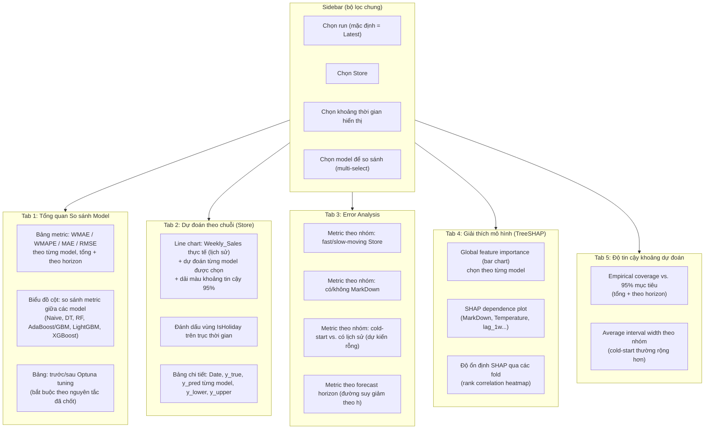

# Đặc tả Dashboard — Streamlit

**AIO Conquer 2026 — Module 03 · Project 3.2**

> Mục tiêu: một dashboard duy nhất tổng hợp (1) biểu đồ dự đoán theo từng phương pháp/model, (2) bảng metric đánh giá so sánh, (3) khoảng dự đoán tin cậy 95% (Split Conformal — xem `08_uncertainty_conformal.md`), (4) TreeSHAP explainability. Chạy bằng `streamlit run app/dashboard.py`, đọc dữ liệu đã có sẵn trong `reports/` và `data/predictions/` (dashboard KHÔNG train model trực tiếp — tách biệt khỏi pipeline theo đúng nguyên tắc modular).

---

## 1. Nguyên tắc thiết kế

1. **Dashboard là lớp trình bày (presentation layer), không chứa logic nghiệp vụ.** Mọi tính toán (metric, SHAP, conformal interval) đã được `pipelines/run_evaluation.py`, `run_shap.py` thực hiện trước và lưu ra file (`reports/`, `data/predictions/`). Dashboard chỉ đọc và vẽ.
2. **Vì sao tách biệt:** nếu dashboard tự tính toán, mentor chạy dashboard sẽ vô tình train lại model mỗi lần mở app (chậm, không tái lập được, dễ lệch với kết quả đã báo cáo). Tách biệt giúp dashboard mở tức thời và luôn hiển thị đúng kết quả đã chốt.
3. **Không hard-code tên model/Store trong code dashboard** — đọc danh sách từ file kết quả, dùng selectbox động. *(Cập nhật 2026-08-19: đơn vị dự báo đã đổi sang (Store, Date), không còn Dept — xem `docs/00_decisions.md`.)*

---

## 2. Wireframe cấu trúc (mermaid)



---

## 3. Chi tiết từng tab

### Tab 1 — Tổng quan So sánh Model
- **Input:** `reports/runs/<run_id>/metrics/model_comparison.parquet` — bảng dài (long format): `model_name, metric_name, value, segment, horizon_group`. `run_id` resolve qua `latest_run.txt` khi sidebar để "Latest" (mặc định), hoặc run cụ thể khi người dùng chọn từ dropdown F0.
- **Bắt buộc có:** Naive baseline luôn hiển thị đầu tiên làm mốc so sánh (đúng nguyên tắc "1 evaluation layer dùng chung mọi model" đã thiết kế).
- **Bắt buộc có:** cột "trước Optuna" vs "sau Optuna" cạnh nhau cho LightGBM/XGBoost — không chỉ hiển thị kết quả cuối.
- **Bổ sung "Lịch sử cải thiện":** đọc `reports/run_history.csv` (qua `load_run_history()`) để vẽ line chart WMAE/WMAPE theo thời gian, filter theo `model_name` — trả lời trực quan câu hỏi "so sánh cải thiện qua các lần chạy" mà không cần mở từng thư mục run.

### Tab 2 — Dự đoán theo chuỗi
- **Input:** `data/predictions/runs/<run_id>/predictions_long.parquet` — cột `Store, Date, model_name, y_true (nullable ở test), y_pred, y_pred_lower, y_pred_upper`. `run_id` resolve độc lập qua `data/predictions/latest_run.txt` (pointer riêng với `reports/`, xem `03_data_io_diagram.md` §5). *(Cập nhật 2026-08-19: bỏ cột `Dept` — đơn vị dự báo đã đổi sang (Store, Date), xem `docs/00_decisions.md`.)*
- Biểu đồ dùng Plotly (line + filled area cho khoảng tin cậy), theo bảng màu nhất quán 1 màu/model xuyên suốt dashboard (định nghĩa 1 lần trong `app/theme.py`, tái sử dụng mọi tab — tránh tình trạng LightGBM màu xanh ở tab này nhưng màu đỏ ở tab khác).
- Cold-start Store-level (dự kiến luôn rỗng trên dữ liệu thật hiện tại, đã xác nhận không có Store nào cold-start) — banner cảnh báo chỉ hiển thị nếu tương lai xuất hiện Store hoàn toàn mới ngoài 45 Store hiện có. Cold-start Dept-level (11 cặp Store-Dept cũ) không còn áp dụng, xem `docs/00_decisions.md`.

### Tab 3 — Error Analysis
- **Input:** `reports/metrics/error_breakdown.parquet`.
- Đồng bộ đúng các lát cắt đã thiết kế ở Giai đoạn 7 trong `02_pipeline_architecture.md` — không thêm lát cắt mới ở tầng dashboard mà pipeline chưa tính.

### Tab 4 — TreeSHAP
- **Input:** `reports/shap_values.parquet` + `reports/figures/*.png` (nếu ảnh đã render sẵn) hoặc tính trực tiếp bằng `shap.plots` nếu dữ liệu SHAP thô có sẵn dưới dạng array đã lưu (`.npz`).
- Cho phép chọn model để xem SHAP riêng — quan trọng vì mục tiêu là so sánh cách LightGBM/XGBoost "nhìn" feature khác nhau ra sao.

### Tab 5 — Độ tin cậy khoảng dự đoán
- **Input:** `reports/metrics/conformal_coverage.parquet` (output của bước 6b/7f trong `08_uncertainty_conformal.md`).
- Hiển thị rõ ràng: coverage mục tiêu (95%, đường tham chiếu ngang) vs. coverage thực nghiệm đo được — không chỉ hiển thị 1 con số mà không có ngữ cảnh so sánh.

---

## 4. Cấu trúc code dashboard (bổ sung vào `04_repo_structure.md`)

```
app/
├── dashboard.py            # Entry point: streamlit run app/dashboard.py
├── theme.py                 # Bảng màu dùng chung 1 model = 1 màu xuyên suốt
├── data_loader.py           # Đọc reports/, data/predictions/ — cache bằng @st.cache_data
├── components/
│   ├── model_comparison.py  # Tab 1
│   ├── series_forecast.py   # Tab 2
│   ├── error_analysis.py    # Tab 3
│   ├── shap_explainer.py    # Tab 4
│   └── conformal_coverage.py # Tab 5
└── __init__.py
```

**Quy tắc:** `app/data_loader.py` là nơi DUY NHẤT đọc file từ `reports/`/`data/predictions/`, dùng `@st.cache_data` để tránh đọc lại file mỗi lần người dùng đổi filter — các file `components/*.py` chỉ nhận DataFrame đã load, không tự đọc file (tách biệt IO khỏi trình bày, cùng tinh thần với nguyên tắc "tách logic feature khỏi logic time-boundary" đã áp dụng ở `src/`).

**Resolve run_id (versioning):** mọi hàm đọc dữ liệu trong `data_loader.py` nhận tham số `run_id: str | None = None`. Khi `None` (giá trị mặc định của sidebar F0 "Latest"), hàm gọi `get_latest_run_id()` (từ `src/sales_forecast/utils/run_tracking.py`) trên `base_dir` tương ứng (`reports/` hoặc `data/predictions/` — 2 pointer độc lập, xem `03_data_io_diagram.md` §5) để tự suy ra run mới nhất; nếu chưa có run nào thành công, raise `MissingResultsError`. Khi người dùng chọn 1 run cụ thể từ dropdown (danh sách lấy từ `get_available_runs()` → `list_runs()`), mọi tab load đúng dữ liệu của run đó thay vì latest — cho phép xem lại/so sánh kết quả cũ mà không cần chạy lại pipeline.

---

## 5. Chạy dashboard

```bash
# Sau khi đã chạy xong pipeline (reports/ và data/predictions/ đã có dữ liệu)
streamlit run app/dashboard.py
```

Nếu `reports/` hoặc `data/predictions/` chưa tồn tại, `app/data_loader.py` phải báo lỗi rõ ràng ("Chưa có kết quả — hãy chạy `python pipelines/run_end_to_end.py` trước") thay vì Streamlit crash với traceback khó hiểu cho mentor không rành code.

---

## 6. Giả định cần test (bổ sung vào `05_test_plan.md`)

| # | Giả định | Test case |
|---|---|---|
| A21 | `data_loader` báo lỗi rõ ràng (không crash traceback thô) khi thiếu file kết quả | `test_data_loader_missing_file_friendly_error` |
| A22 | Bảng màu model nhất quán giữa các lần gọi `theme.py` (không random mỗi lần chạy) | `test_theme_color_mapping_deterministic` |
| A23 | Dashboard không tự train model / không import trực tiếp `lightgbm.train` (chỉ đọc file kết quả) | `test_dashboard_has_no_training_calls` (kiểm tra tĩnh bằng AST hoặc import graph) |
| A34 | `load_predictions(run_id=None)` trả đúng dữ liệu của run mà `data/predictions/latest_run.txt` đang trỏ tới | `test_data_loader_resolves_latest_run_by_default` |
| A35 | `load_predictions(run_id="<run cũ cụ thể>")` đọc đúng dữ liệu run cũ đó, không lẫn với latest | `test_data_loader_can_load_specific_historical_run` |

```python
# tests/test_app/test_data_loader.py
import pytest
from app.data_loader import load_predictions, MissingResultsError


def test_data_loader_missing_file_friendly_error(tmp_path):
    """Giả định A21: khi chưa chạy pipeline, dashboard phải báo lỗi có hướng dẫn
    rõ ràng, không phải FileNotFoundError trần trụi khó hiểu với mentor."""
    with pytest.raises(MissingResultsError, match="run_end_to_end"):
        load_predictions(base_dir=tmp_path)
```

```python
# tests/test_app/test_theme.py
from app.theme import get_model_color


def test_theme_color_mapping_deterministic():
    """Giả định A22: cùng 1 model_name luôn trả về đúng 1 màu, gọi nhiều lần
    không đổi (tránh nhầm lẫn khi so sánh biểu đồ giữa các tab)."""
    c1 = get_model_color("lightgbm")
    c2 = get_model_color("lightgbm")
    assert c1 == c2
```
