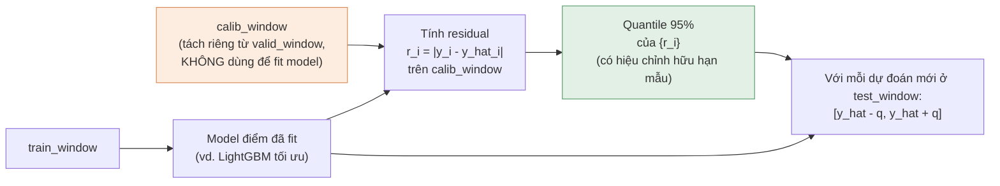
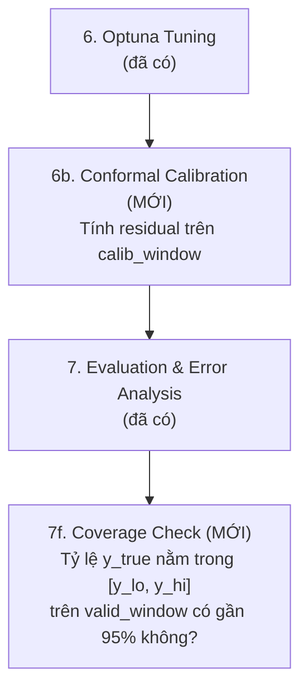

# Khoảng dự đoán tin cậy 95% — Split Conformal Prediction

**AIO Conquer 2026 — Module 03 · Project 3.2**

> Đây là yêu cầu kỹ thuật bổ sung: mọi dự đoán điểm (point forecast) phải đi kèm khoảng dự đoán tin cậy 95% [y_lo, y_hi]. Phương pháp chọn: **Split Conformal Prediction** — không cần train lại model theo quantile loss, áp dụng đồng loạt cho mọi tree model (Decision Tree, RF, AdaBoost/GBM, LightGBM, XGBoost) bằng cách bọc thêm (wrap) sau khi đã có model điểm.

---

## 1. Vì sao chọn Split Conformal thay vì Quantile Regression

| Tiêu chí | Split Conformal Prediction | Quantile Regression (train riêng model 2.5%/97.5%) |
|---|---|---|
| Số model cần train | Không tăng — dùng residual của model điểm đã có | Gấp đôi/gấp ba số model (mỗi quantile 1 model riêng) |
| Đảm bảo coverage | Có đảm bảo thống kê hữu hạn mẫu (finite-sample), miễn dữ liệu conformal exchangeable | Không có đảm bảo hình thức, phụ thuộc chất lượng fit quantile loss |
| Tương thích Optuna | Không ảnh hưởng search space đã thiết kế | Phải mở rộng search space cho từng model quantile → tăng chi phí tính toán đáng kể |
| Áp dụng đồng loạt nhiều model cây | Có — cùng 1 cơ chế wrap cho DT/RF/LightGBM/XGBoost | Không — LightGBM/XGBoost hỗ trợ quantile loss native khác nhau, DT/RF/AdaBoost không hỗ trợ trực tiếp |
| Rủi ro leakage bổ sung | Thấp nếu dùng đúng residual từ `valid_window` (walk-forward), không đụng `test_window` | Tương tự, nhưng thêm rủi ro tuning riêng cho quantile model |

**Kết luận:** Split Conformal Prediction phù hợp hơn với kiến trúc modular đã thiết kế (một Evaluation Layer dùng chung mọi model) và với ràng buộc thời gian còn lại của Module 03.

---

## 2. Nguyên lý — bám sát nguyên tắc "cắt mốc trước, tính sau" đã có



### Công thức

Với tập hiệu chỉnh (calibration set) gồm `n` quan sát, residual tuyệt đối `r_i = |y_i − ŷ_i|`, mức tin cậy 95% (α = 0.05):

```
q = quantile_{⌈(n+1)(1-α)⌉ / n} ({r_1, ..., r_n})
```

Khoảng dự đoán cho quan sát mới: `[ŷ_new − q, ŷ_new + q]`.

> Dùng công thức `⌈(n+1)(1-α)⌉ / n` (không phải đơn giản `1-α`) — đây là hiệu chỉnh bắt buộc để đảm bảo coverage đúng ở mẫu hữu hạn, sai nếu chỉ lấy `np.quantile(residuals, 0.95)` thông thường khi `n` nhỏ.

---

## 3. Ràng buộc thời gian — KHÔNG được vi phạm nguyên tắc chống leakage đã thiết kế

Đây là điểm dễ sai nhất khi thêm conformal prediction vào pipeline đã có:

1. **`calib_window` phải tách riêng khỏi `train_window` dùng để fit model** — nếu dùng residual trên chính tập đã train, residual sẽ bị đánh giá thấp một cách hệ thống (model luôn khớp tốt hơn trên dữ liệu đã thấy) → khoảng tin cậy quá hẹp, sai lệch với thực tế.
2. **`calib_window` phải nằm SAU `train_window` về thời gian** (giống `valid_window` trong Temporal Split đã thiết kế ở giai đoạn 2) — không được lấy ngẫu nhiên từ giữa chuỗi thời gian, vi phạm đúng nguyên tắc walk-forward đã có.
3. Đề xuất cụ thể: chia `valid_window` hiện có thành 2 phần — nửa đầu dùng cho Optuna tuning (đã thiết kế ở giai đoạn 6), nửa sau dùng làm `calib_window` cho conformal. Không tạo thêm một cửa sổ thời gian mới nằm chồng lấn.
   > **Lưu ý nếu áp dụng retrain trên train+valid sau tuning** (xem `01_ideation.md` mục 4b, để mở, chưa chốt): nếu model được fit lại trên toàn bộ `train_window + valid_window` sau khi Optuna đã chốt `best_params`, `valid_window` KHÔNG còn tồn tại độc lập để cung cấp `calib_window` — bắt buộc phải dành riêng một cửa sổ thời gian mới (nằm sau cả phần đã dùng để retrain) làm `calib_window`, không được lấy residual từ dữ liệu model retrain đã thấy.
4. **Không bao giờ dùng `test_window` để tính residual hiệu chỉnh** — kể cả khi horizon dài (39 tuần), phải tôn trọng đúng ranh giới đã chốt ở `docs/00_decisions.md`.
5. Với dữ liệu time-series, tính "exchangeability" (giả định nền tảng của conformal prediction cổ điển) không hoàn toàn đúng — cần báo cáo rõ đây là giới hạn phương pháp trong phần Evaluation & Error Analysis, không mặc định coverage 95% là chính xác tuyệt đối trên `test_window` tương lai xa.

---

## 4. Vị trí trong pipeline 10 giai đoạn

Bổ sung vào `02_pipeline_architecture.md` như một bước con của **Giai đoạn 7 (Evaluation & Error Analysis)**, chạy sau khi model đã được Optuna tối ưu ở Giai đoạn 6:



**Output mới:** mỗi dòng dự đoán trong `submission.csv`/`predictions/` có thêm 2 cột `y_pred_lower`, `y_pred_upper` bên cạnh `y_pred` — cập nhật vào bảng schema ở `03_data_io_diagram.md`. `conformal_coverage.parquet` ghi vào `reports/runs/<run_id>/metrics/` (không phải `reports/metrics/` tĩnh) — xem cơ chế run tracking ở `03_data_io_diagram.md` §5 và `src/sales_forecast/utils/run_tracking.py`.

---

## 5. Đánh giá chất lượng khoảng tin cậy (bắt buộc báo cáo, không chỉ báo cáo coverage trung bình)

| Metric | Ý nghĩa | Ngưỡng kỳ vọng |
|---|---|---|
| **Empirical Coverage** | Tỷ lệ `y_true` thực sự nằm trong `[y_lo, y_hi]` trên `valid_window` | Gần 95% (lệch quá xa → có vấn đề exchangeability hoặc leakage) |
| **Average Interval Width** | Độ rộng trung bình `y_hi - y_lo` | Càng hẹp càng tốt, với điều kiện coverage vẫn đạt ~95% |
| **Coverage theo horizon** | Coverage có suy giảm khi horizon xa hơn không? | Cần theo dõi — do vi phạm exchangeability nghiêm trọng hơn ở horizon xa (liên hệ trực tiếp vấn đề Forecast Horizon đã nêu ở `01_ideation.md`) |
| **Coverage theo cold-start vs. có lịch sử** | Model có residual lớn hơn ở nhóm cold-start → interval rộng hơn tương ứng không? | Interval ở nhóm cold-start nên rộng hơn rõ rệt, nếu không → dấu hiệu model tự tin sai |

---

## 6. Giả định cần test (bổ sung vào `05_test_plan.md`)

| # | Giả định | Test case |
|---|---|---|
| A16 | `calib_window` không trùng với `train_window` dùng để fit model | `test_conformal_no_train_calib_overlap` |
| A17 | `calib_window` nằm sau `train_window` về thời gian (không random) | `test_conformal_calib_after_train` |
| A18 | Công thức quantile dùng hiệu chỉnh hữu hạn mẫu đúng, không phải `np.quantile` trần | `test_conformal_finite_sample_correction` |
| A19 | Interval luôn thỏa `y_lo ≤ y_pred ≤ y_hi` cho mọi dòng | `test_conformal_interval_contains_point_forecast` |
| A20 | Empirical coverage trên `valid_window` nằm trong khoảng chấp nhận được (vd. 90–99% cho mục tiêu 95%) | `test_conformal_empirical_coverage_reasonable` |

### Skeleton test bổ sung

```python
# tests/test_evaluation/test_conformal_prediction.py
import numpy as np
import pandas as pd
from sales_forecast.evaluation.conformal import (
    fit_conformal_calibrator,
    predict_with_interval,
)


def test_conformal_finite_sample_correction():
    """Giả định A18: quantile phải dùng hiệu chỉnh (n+1)(1-alpha)/n,
    KHÔNG được dùng np.quantile(residuals, 0.95) trực tiếp."""
    residuals = np.abs(np.random.default_rng(0).normal(0, 10, size=50))
    calibrator = fit_conformal_calibrator(residuals, alpha=0.05)
    naive_q = np.quantile(residuals, 0.95)
    # Với n nhỏ, quantile đã hiệu chỉnh phải khác (thường lớn hơn hoặc bằng) naive quantile
    assert calibrator.q != naive_q or len(residuals) > 500


def test_conformal_interval_contains_point_forecast():
    """Giả định A19: mọi khoảng dự đoán phải chứa đúng điểm dự đoán trung tâm."""
    y_pred = np.array([100.0, 200.0, 50.0])
    lo, hi = predict_with_interval(y_pred, q=15.0)
    assert (lo <= y_pred).all() and (y_pred <= hi).all()


def test_conformal_empirical_coverage_reasonable(sample_train):
    """Giả định A20: coverage thực nghiệm trên valid_window phải nằm trong
    khoảng chấp nhận được quanh 95% (không quá lệch, cảnh báo sớm nếu leakage
    khiến coverage giả tạo gần 100% hoặc quá thấp do lỗi tính toán)."""
    # Triển khai cụ thể cần model + calib_window + valid_window thật;
    # đây là skeleton xác định ngưỡng chấp nhận, không phải giá trị cố định 95.0%
    lower_bound_acceptable = 0.85
    upper_bound_acceptable = 1.0
    # coverage = tính từ pipeline thật
    # assert lower_bound_acceptable <= coverage <= upper_bound_acceptable
```
